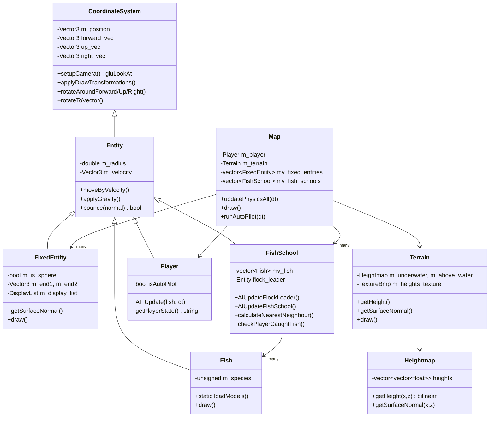

# Underwater World — OpenGL Underwater Exploration Game

A real-time 3D underwater environment built from scratch in C++ and legacy (fixed-function) OpenGL — heightmap terrain, textured skybox and water surface, procedurally-scattered plants, boids-style fish flocking AI, a physics model (gravity/drag/bounce), an autopilot steering system, and a data-driven level format. Originally built as the solution for **CS 409, Assignment 4** (University of Waterloo).

▶ **Demo video:** _TODO — add the recording link here_

---

## 1. Overview

You control a diver (`Player`) swimming through a heightmap-based seabed populated with fixed obstacles (rocks, tunnels, buoys) and schools of fish that flock using a boids-style steering model. The world has:

- **Physics** — gravity above water, velocity drag underwater, elastic bounce off collision surfaces
- **Collision detection** — sphere-vs-sphere, sphere-vs-oriented-cylinder, sphere-vs-heightmap
- **Fish AI** — separation + seek steering combined into a flocking behavior, driven by a wandering "flock leader" entity
- **Player autopilot** — a small state machine that auto-swims the player toward a target fish after a catch
- **Depth-based fog** — fog color and density interpolate with depth to simulate underwater light falloff
- **A custom text-based level format** (`map.txt`) that places terrain, obstacles, and fish schools without recompiling

It renders with the classic OpenGL 1.x fixed-function pipeline (`glBegin`/`glEnd`, matrix stack, display lists) via GLUT, which is what makes it possible to still compile and run today on macOS, Linux, and Windows with no dependency installation — see [§8 Build & Run](#8-build--run).

---

## 2. Architecture



**Inheritance is the core organizing principle**: every object that exists in 3D space — the player, a rock, a fish, an entire fish school — derives from a single `Entity` base, which itself derives from `CoordinateSystem`. This means position/orientation math, velocity, gravity, and bounce physics are written **once** and reused by every game object, and generic code like `Collision.cpp` and `Map::updatePhysicsAll` can operate on any `Entity` without knowing its concrete type. A `FishSchool` is itself an `Entity` with its own position and radius (the bounding sphere of its fish) — that's what lets fish-vs-obstacle collision be checked at the school level first, before descending into per-fish checks (see §4).

---

## 3. Coordinate System & Camera (`CoordinateSystem.h/.cpp`)

Every object owns a local orthonormal basis — `forward`, `up`, `right` — instead of an Euler-angle or single rotation-matrix representation:

- **Camera setup** is one line: `gluLookAt(position, position + forward, up)`.
- **Rendering transform**: `applyDrawTransformations()` builds a 4×4 column-major matrix directly from the three basis vectors and hands it to `glMultMatrixd`, avoiding gimbal-lock-prone Euler angles entirely.
- **Rotation primitives** (`rotateAroundForward/Up/Right`, `rotateAroundArbitrary`) rotate the *other two* basis vectors around the fixed axis via `Vector3::rotateArbitrary` (Rodrigues' rotation formula, implemented in ObjLibrary).
- **`rotateToVector(desired, max_radians)`** is the steering primitive everything else builds on: it computes the axis (`forward × desired`), clamps the angle to `max_radians`, and rotates the whole basis toward the target by at most that much per call — this is what makes fish and the autopilot turn smoothly instead of snapping.
- **`rotateToUpright(max_radians)`** self-corrects roll: it computes the "ideal" up vector for the current forward direction and rotates `up`/`right` toward it, which is why fish and the player never end up permanently upside-down after a bounce.

---

## 4. Entity System & Physics (`Entity.h/.cpp`, `FixedEntity`, `Fish`, `Player`)

`Entity` adds a **radius** and **velocity** on top of `CoordinateSystem`:

| Method | What it does |
|---|---|
| `moveByVelocity(dt)` | Euler-integrates position: `position += velocity * dt` |
| `applyGravity(dt)` | Adds a constant `(0, -9.8, 0)` to velocity, scaled by `dt` |
| `bounce(normal)` | Elastic reflection: splits velocity into components parallel (`projection`) and perpendicular (`rejection`) to the surface normal, then returns `rejection - projection` — this negates only the component going *into* the surface, so an entity sliding along a wall keeps its tangential speed |

**`FixedEntity`** models static world geometry as either a **sphere** (center + radius) or an **oriented cylinder/capsule** (two endpoints + radius), covering both cases with one class. `getSurfaceNormal(query_pos)` dispatches to `getSurfaceNormalSphere` or `getSurfaceNormalOrientedCylinder` (in `SurfaceNormal.cpp`) depending on which shape it is — this single function is what every bounce call in the game uses to know which direction to reflect off of, regardless of obstacle shape.

**Collision detection** (`Collision.cpp`) is a small set of overloaded free functions rather than a method on each class, which keeps the geometry math out of the entity classes:

- **Sphere vs. sphere**: `distance(centers) < r1 + r2`
- **Sphere vs. cylinder**: project the sphere center onto the cylinder's axis using `getRejection`/`getProjection`; reject if the perpendicular distance exceeds the combined radius, or if the projected point falls outside the two end caps
- **Sphere vs. terrain**: `terrain.getHeight(position) + radius > position.y`

---

## 5. Terrain & Heightmap Rendering (`Terrain`, `Heightmap`)

Terrain height comes from the **red channel of a grayscale BMP** (`heightmap.bmp`) — each pixel becomes one grid vertex, normalized to `[0, 1]`. Two separate `Heightmap` instances are built from the *same* height data but textured and scaled differently (`initDisplayList` with different texture-repeat parameters): one for the underwater floor (dirt texture, tighter repeat) and one for the visible-from-above terrain (grass texture, wider repeat, drawn 1.1× taller so it doesn't z-fight with the underwater mesh at the shoreline).

**Height queries at arbitrary (non-grid-aligned) positions** use bilinear-style interpolation, but the grid cell is actually split into two triangles and the query point's barycentric-style weights are computed relative to whichever triangle it falls in (`i_frac > k_frac` picks the diagonal):

```
weight00 = 1 - i_frac,  weight11 = k_frac,  weight10 = 1 - weight00 - weight11
height = weight00·h(i0,k0) + weight11·h(i1,k1) + weight10·h(i1,k0)
```

**Surface normals** are computed per-triangle from the same two edge vectors via cross product, then normalized — so normals are flat per-triangle (faceted), not smoothed across the mesh, which is why `drawTerrainSurfaceNormals` (key `4`) shows a slightly blocky normal field up close.

**Procedural plant placement**: `Terrain::initAllPlantsList` walks every heightmap cell and places a plant model wherever the **green channel** of the same heightmap texture is `≥ 64` — so the single heightmap BMP doubles as both a height field (red channel) and a plant-density mask (green channel), authored together in one image. All plant instances are baked into **one display list** at load time rather than drawn individually per frame.

---

## 6. Fish AI — Boids-Style Flocking (`FishSchool.cpp`)

Each `FishSchool` owns a `vector<Fish>` plus an invisible `flock_leader` entity that wanders autonomously and pulls the whole school along.

**Flock leader wandering** (`AIUpdateFlockLeader`): picks a random point on the school's bounding sphere as `current_explore_target`; once within one frame's travel distance of it, picks a new random target. Its own velocity is steered toward that target using the same seek formula used everywhere else in the codebase:

```
desired      = normalize(target - position) * max_speed
steering     = truncate(desired - current_velocity, max_acceleration * dt)
new_velocity = current_velocity + steering
```

**Per-fish flocking** (`AIUpdateForFish`) combines two forces:
1. **Seek the leader** — same formula as above, target = leader position
2. **Separation** — for each of a fish's 4 nearest neighbors, if closer than `radius * 4`, push away with magnitude `(1 - distance/max_separation)² * max_speed` (an inverse-square-ish falloff so close neighbors repel much harder than distant ones)

The combined desired velocity is `seek + 3.0 * separation`, truncated to the species' max speed, then run through the same acceleration-clamped steering as the leader.

**Nearest-neighbor search is deliberately throttled**, not run every frame for every fish — `calculateNearestNeighbour()` only recomputes neighbors for fish at index `counter, counter+60, counter+120, ...` each physics tick, then increments `counter` and wraps at 60. This amortizes an O(n²) all-pairs distance search across 60 frames so a large school doesn't spike frame time, at the cost of each individual fish's neighbor list being up to 60 ticks (~1 second at 60Hz) stale.

**Catching fish**: `FishSchool::checkPlayerCaughtFish` first does one cheap school-vs-player sphere check (`isCollision(*this, player)`, using the *school's own bounding sphere*, maintained by `changeBoundingSphere()` recentring it on the fish's average position each frame) before falling through to checking every individual fish — a coarse-to-fine collision pattern that avoids O(n) checks against schools the player isn't even near.

---

## 7. Player Autopilot (`Player.cpp`, `Map::runAutoPilot`)

After the player catches a fish, `Map::turnOnAutoPilot()` picks a random fish from the nearest school as a target and hands control to a small state machine in `Player::AI_Update`, driven every physics tick by `Player::getPlayerState()`:

| State | Trigger | Behavior |
|---|---|---|
| **Swimming to surface** | Player is deeper than 1m below the target's projected position and not yet close | Zeroes horizontal velocity, accelerates straight up |
| **Swimming horizontal** | Player is near the surface but still far (XZ distance ≥ 5m) from the target | Seeks the target's horizontal position, `y`-velocity zeroed, orientation follows the steering direction |
| **Chasing a fish** | Within 5m (XZ) of the target | Full 3D seek toward the fish's projected future position (`fish_position + fish_velocity * dt` — steering toward where the fish *will be*, not where it is) |

Any manual input (arrow keys, `WASD`, space/`/`) immediately calls `map.turnOffAutoPilot()`, so the player can override the autopilot at any time — it's advisory, not a lock.

---

## 8. Game Loop & Time Management (`main.cpp`, `TimeManager`)

The loop decouples **simulation rate** from **render rate** using a fixed-timestep accumulator pattern:

```
update():  # GLUT idle callback — runs as fast as possible
    while updates_waiting and updates_this_frame < max_updates_per_frame:
        doGameUpdates()          # fixed dt = 1/60s, always
        markNextUpdate()
    sleepUntilNextUpdate()        # give CPU back if ahead of schedule
    glutPostRedisplay()

display():  # GLUT display callback — runs once per actual frame
    draw the world at whatever the current interpolated state is
```

This means physics is always stepped at a constant `1/60s` regardless of actual frame rate, capped at 10 catch-up updates per frame (`max_updates_per_frame`) so a stall doesn't cause a death-spiral of ever-growing catch-up work. `TimeManager` tracks **three separate rate measures** for both updates and frames — instantaneous (`1 / last_delta`), a running average since start, and an exponentially-smoothed rate (`0.95 * old + 0.05 * new`) — all visible via the in-game frame-rate debug overlay (key `1`).

---

## 9. Rendering Pipeline

- **Display lists everywhere**: terrain, plants, fish models, the skybox, and the water surface are all compiled into OpenGL display lists once at load time (`ObjLibrary::DisplayList`, reference-counted so copies are cheap) rather than re-issuing raw vertex commands every frame.
- **Skybox trick**: drawn first, translated to follow the camera position exactly (so it never appears to move), with depth-writes disabled (`glDepthMask(GL_FALSE)`) and fog disabled — this pins it infinitely far away without needing a separate projection pass.
- **Depth-based fog** (`Map::updateFog`): fog color's green and blue channels are interpolated by normalized depth (`depth / MAX_DEPTH`, clamped implicitly since it's only called underwater) — deeper water shifts toward a darker blue as light falloff would suggest, and `glClearColor` is kept in sync with the fog color so the far clip plane blends seamlessly into the background.
- **2D HUD overlay** (`SpriteFont`, from ObjLibrary): switches to an orthographic projection (`setUp2dView`) to draw text (catch count, depth, autopilot state, frame-rate debug, the F1 key-binding help panel) on top of the fully-rendered 3D scene, then restores 3D projection state afterward.

---

## 10. Data-Driven Level Format (`Resources/map.txt`)

The level isn't hardcoded — it's parsed line-by-line from a plain-text file, dispatched on the first character:

```
t  x_off y_off z_off  x_size y_size z_size  heightmap.bmp     # terrain
p  x y z   fx fy fz   ux uy uz                                # player start (pos, forward, up)
s  x y z   radius              model.obj                      # sphere obstacle
c  x1 y1 z1  x2 y2 z2  radius  model.obj                       # cylinder obstacle
f  x y z   radius  count  max_explore_dist  fish_model.obj     # fish school
```

Loaded models are cached in an `unordered_map<filename, DisplayList>` (`sphere_lists` / `cylinder_lists` in `Map.cpp`) so placing the same obstacle model multiple times (e.g. 8 buoys in the sample level) only loads and compiles the `.obj` once. This is what makes the level a **content file, not code** — adding a new obstacle or fish school to the world is a one-line text edit, no recompilation.

---

## 11. Asset Pipeline — ObjLibrary (third-party)

Model/texture loading, math primitives (`Vector2`/`Vector3`), and text rendering are provided by **[ObjLibrary](http://infiniplix.ca/resources/obj_library/) by Richard Hamilton** (vendored under `ObjLibrary/`, not written for this project) — `.obj`/`.mtl` parsing (`ObjModel`, `MtlLibrary`), BMP texture loading with a load-once cache (`TextureManager`), and bitmap font rendering (`SpriteFont`). This project's own code sits entirely on top of it: `Vector3` provides the projection/rejection/cross-product operations that `Collision.cpp`, `SurfaceNormal.cpp`, and the steering code all depend on.

---

## 12. Controls

| Key | Action |
|---|---|
| `↑ ↓ ← →` | Pitch / yaw the player |
| `Space` / `/` | Move forward / backward |
| `W A S D` | Strafe up / left / down / right |
| `, .` | Roll left / right |
| `Z` | Engage autopilot toward the nearest fish |
| `H` | Turn to face the world origin |
| `P` | Pause |
| `R` | Reset player to start, cancel autopilot |
| `1` | Toggle frame-rate / update-rate debug overlay |
| `2` | Toggle nearby fish-school debug visualization |
| `3` | Toggle nearest fixed-entity surface-normal display |
| `4` | Toggle terrain surface-normal display |
| `F1` | Toggle on-screen key-binding help |
| `Esc` | Quit |

> **macOS note:** `F1` is bound to display brightness by default on Mac keyboards — hold **Fn+F1** to send the actual function-key code, or flip *System Settings → Keyboard → Keyboard Shortcuts → Function Keys* to use F-keys as standard function keys.

---

## 13. Cross-Platform Build

The codebase was already written to be portable, via one indirection header (`GetGlut.h`) and one indirection source file (`Sleep.h`/`.cpp`):

| Platform | GL/GLUT headers | `sleep()` implementation |
|---|---|---|
| Windows | `freeglut.h` (vendored `.dll`/`.lib`/headers, linked via the `.vcxproj`) | `Sleep(ms)` from `<windows.h>` |
| macOS | `<OpenGL/gl.h>`, `<GLUT/glut.h>` (Apple's system frameworks — deprecated since 10.14 but still present) | `nanosleep` (POSIX branch) |
| Linux | `<GL/gl.h>`, `<GL/glu.h>`, `<GL/glut.h>` | `nanosleep` (POSIX branch) |

So the `.sln`/`.vcxproj`/`freeglut.*` files in this repo are only the **Windows build wrapper** — they're not required to build on Mac or Linux, where the code path routes to the system OpenGL/GLUT frameworks instead.

---

## 14. Build & Run

**Windows:** open `Solution-4.sln` in Visual Studio, build, run — `freeglut.dll` is already vendored in the repo root.

**macOS / Linux:** no package manager needed — compile every `.cpp` directly against the system frameworks:

```bash
clang++ -std=c++14 -Wno-deprecated-declarations -I. -IObjLibrary \
    *.cpp ObjLibrary/*.cpp \
    -framework OpenGL -framework GLUT -framework Cocoa \
    -o underwater

./underwater   # must run from the repo root so it can find Resources/
```

On Linux, swap the `-framework` flags for `-lGL -lGLU -lglut`.

---

## 15. Known Issues (found while reading the code)

- `main.cpp`'s `keyboard()` switch is missing a `break` after `case '4'`, so toggling terrain-normal display (key `4`) also always triggers the `case '5'` flock-to-player behavior as a side effect.
- `display_flock_to_player` is set `true` on key `5` but never set back to `false`, so once triggered it keeps forcing the nearest fish school's explore target to the player's position every frame.
- `Player::getPlayerState()` has no `return` on the fall-through path if `current_autoPilot_state` is ever outside `{0,1,2}` (compiler warning, not currently reachable in practice).
